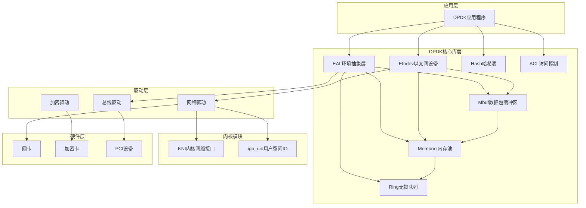
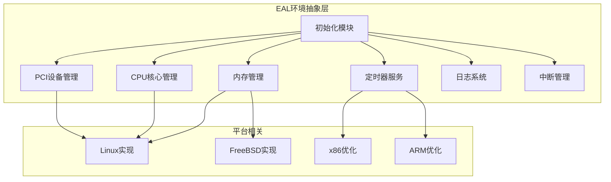
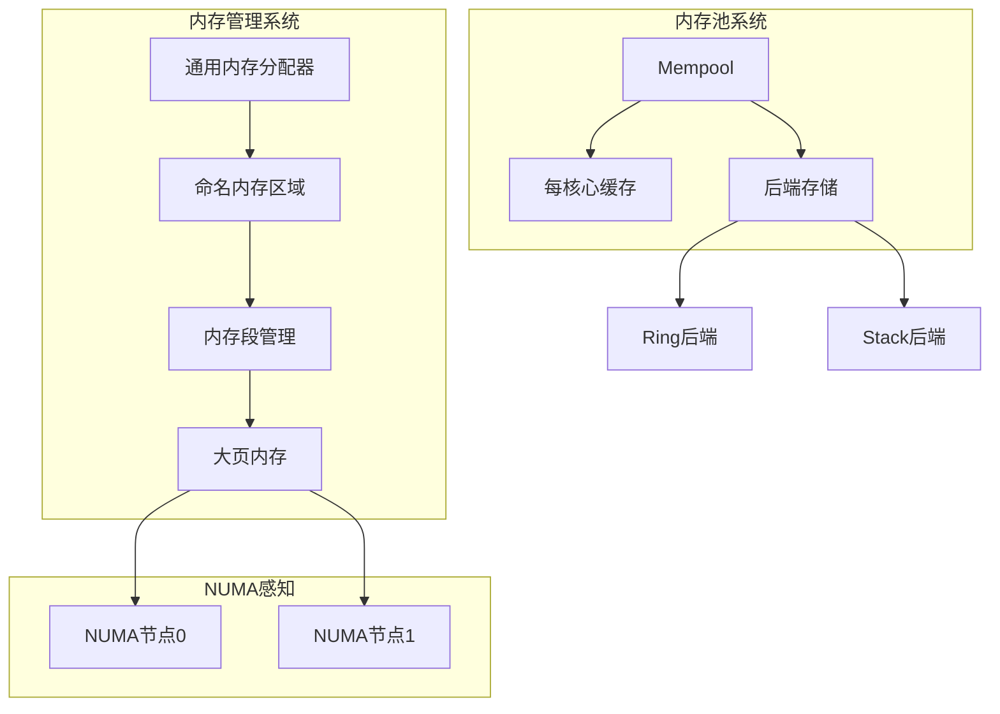
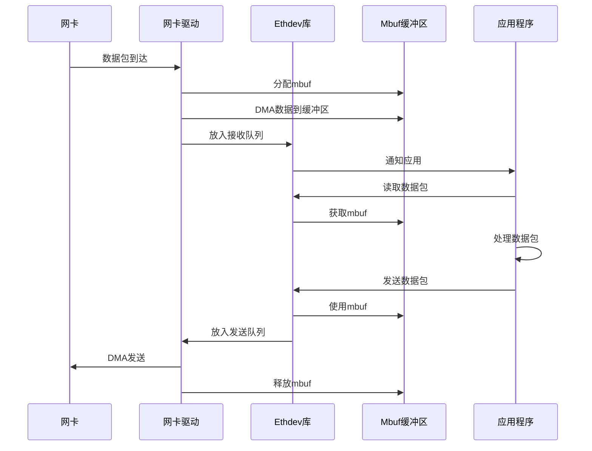
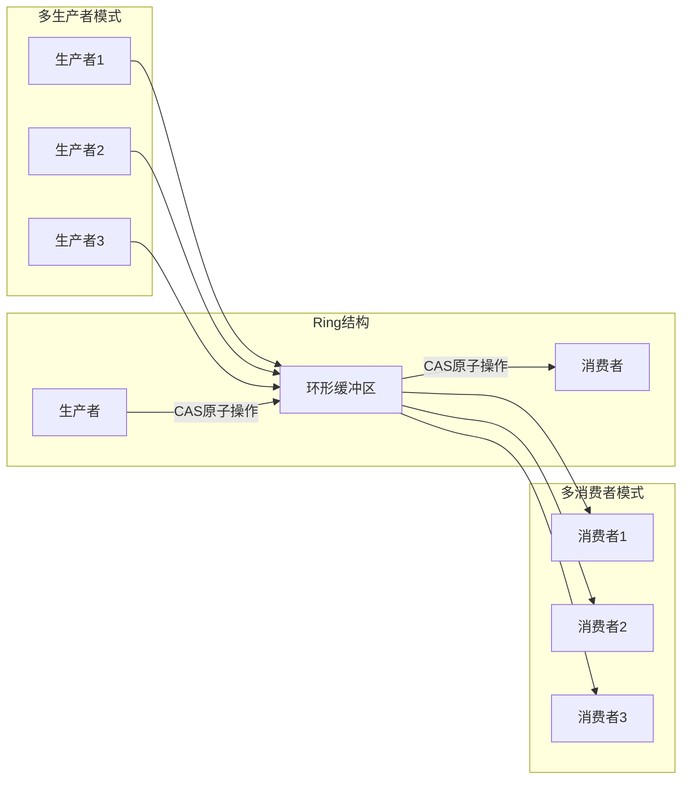

# DPDK代码结构与原理分析文档

## 目录
1. [概述](#概述)
2. [代码结构分析](#代码结构分析)
3. [核心原理](#核心原理)
4. [架构图](#架构图)
5. [关键组件详解](#关键组件详解)
6. [数据流分析](#数据流分析)
7. [性能优化技术](#性能优化技术)

---

## 概述

### DPDK简介

**Data Plane Development Kit (DPDK)** 是一个用于快速数据包处理的库和驱动集合，由Intel开发并开源。它通过绕过Linux内核，直接在用户空间进行数据包处理，实现高性能网络应用。

### 核心特性

1. **用户空间驱动**: 绕过内核，零拷贝数据包处理
2. **轮询模式**: 避免中断开销，提高性能
3. **大页内存**: 减少TLB miss，提高内存访问效率
4. **NUMA感知**: 优化多核系统性能
5. **无锁数据结构**: 高性能并发操作
6. **SIMD优化**: 利用CPU向量指令加速处理

### 在SPDK中的位置

SPDK将DPDK作为子模块，主要用于：
- 环境抽象层(EAL)提供平台无关接口
- 内存管理和大页内存支持
- PCI设备访问和管理
- CPU核心管理和线程模型
- 基础数据结构和同步原语

---

## 代码结构分析

### 顶层目录结构

```
dpdk/
├── lib/                    # 核心库目录
│   ├── librte_eal/         # 环境抽象层（核心）
│   ├── librte_ring/        # 无锁环形队列
│   ├── librte_mempool/     # 内存池管理
│   ├── librte_mbuf/        # 数据包缓冲区
│   ├── librte_ethdev/      # 以太网设备抽象
│   ├── librte_hash/        # 哈希表
│   ├── librte_acl/         # 访问控制列表
│   └── ...                 # 其他库
├── drivers/                # 驱动程序目录
│   ├── net/                # 网络驱动
│   ├── crypto/             # 加密驱动
│   ├── compress/           # 压缩驱动
│   ├── bus/                # 总线驱动
│   └── mempool/            # 内存池驱动
├── kernel/                 # 内核模块
│   └── linux/
│       ├── kni/            # 内核网络接口
│       └── igb_uio/       # 用户空间IO驱动
├── examples/               # 示例程序
├── usertools/             # 用户工具
├── buildtools/            # 构建工具
└── doc/                   # 文档
```

### 核心库依赖关系

```
librte_eal (基础层)
    ├── librte_kvargs
    └── librte_telemetry
        │
        ├── librte_ring (无锁队列)
        │   └── librte_rcu (RCU同步)
        │
        ├── librte_mempool (内存池)
        │   ├── 依赖: librte_ring
        │   └── 后端: ring/stack/bucket
        │
        ├── librte_mbuf (数据包缓冲区)
        │   └── 依赖: librte_mempool
        │
        ├── librte_ethdev (以太网设备)
        │   ├── 依赖: librte_mbuf, librte_mempool
        │   └── 驱动: drivers/net/*
        │
        ├── librte_hash (哈希表)
        │   └── 依赖: librte_ring
        │
        ├── librte_acl (访问控制)
        │   └── SIMD优化实现
        │
        └── 其他库...
```

### 库构建顺序

根据 `lib/meson.build`，库的构建顺序为：

1. **基础层**: `kvargs`, `telemetry`
2. **核心层**: `eal` (所有库的基础)
3. **数据结构层**: `ring`, `rcu`
4. **内存管理层**: `mempool`, `mbuf`
5. **网络层**: `net`, `ethdev`
6. **应用层**: `acl`, `hash`, `lpm`, `pipeline` 等

---

## 核心原理

### 1. 环境抽象层(EAL)原理

#### 初始化流程

```c
rte_eal_init()
    ├── eal_create_runtime_dir()      // 创建运行时目录
    ├── eal_parse_args()              // 解析命令行参数
    ├── eal_hugepage_info_init()      // 初始化大页内存信息
    ├── eal_memalloc_init()           // 初始化内存分配器
    ├── rte_eal_memory_init()         // 初始化内存系统
    ├── rte_eal_pci_init()            // 初始化PCI子系统
    ├── rte_eal_timer_init()          // 初始化定时器
    └── rte_eal_intr_init()           // 初始化中断系统
```

#### 内存管理原理

**大页内存机制**:
- 使用2MB或1GB大页替代4KB标准页
- 减少页表项数量，降低TLB miss率
- 通过 `/sys/kernel/mm/hugepages` 管理

**NUMA感知**:
- 检测NUMA拓扑结构
- 本地内存分配（避免跨节点访问）
- 设备绑定到NUMA节点

**内存布局**:
```
共享内存区域 (mmap)
├── mem_config (全局配置)
├── memseg (内存段)
│   ├── 大页内存段1
│   ├── 大页内存段2
│   └── ...
└── memzone (命名内存区域)
```

#### CPU核心管理

**Lcore (Logical Core)模型**:
- 每个逻辑核心对应一个线程
- 支持核心绑定（CPU affinity）
- 主核心(master lcore)和从核心(slave lcore)

**核心启动流程**:
```c
rte_eal_remote_launch(func, arg, lcore_id)
    ├── 创建pthread线程
    ├── 绑定到指定CPU核心
    └── 执行用户函数
```

### 2. 无锁环形队列(Ring)原理

#### 数据结构

```c
struct rte_ring {
    char name[RTE_RING_NAMESIZE];    // 队列名称
    int flags;                        // 标志位
    uint32_t size;                    // 队列大小（2的幂）
    uint32_t mask;                    // size - 1（用于快速取模）
    uint32_t capacity;                // 容量（size - 1）
    
    // 生产者相关
    struct rte_ring_headtail prod;    // 生产者头尾指针
    // 消费者相关
    struct rte_ring_headtail cons;    // 消费者头尾指针
    
    // 元素数组（紧跟在结构体后面）
    // void *ring[];
};
```

#### 无锁算法

**多生产者/多消费者模式**:

1. **CAS (Compare-And-Swap)操作**:
   - 使用原子操作更新head/tail指针
   - 避免锁竞争

2. **批量操作优化**:
   - 一次操作多个元素
   - 减少CAS操作次数

3. **同步模式**:
   - **SP/SC**: 单生产者/单消费者（最快）
   - **MP/MC**: 多生产者/多消费者（通用）
   - **MP_RTS/MC_RTS**: RTS (Relaxed Tail Sync)模式
   - **MP_HTS/MC_HTS**: HTS (Head-Tail Sync)模式

#### 入队/出队流程

**入队流程**:
```c
rte_ring_enqueue_bulk()
    ├── 加载生产者head (load acquire)
    ├── 检查空间是否足够
    ├── CAS更新head指针
    ├── 写入元素到ring数组
    └── 更新tail指针 (store release)
```

**出队流程**:
```c
rte_ring_dequeue_bulk()
    ├── 加载消费者head (load acquire)
    ├── 检查是否有数据
    ├── CAS更新head指针
    ├── 读取元素从ring数组
    └── 更新tail指针 (store release)
```

### 3. 内存池(Mempool)原理

#### 设计目标

- 快速分配/释放固定大小对象
- 减少内存碎片
- 每核心缓存优化
- NUMA感知

#### 数据结构

```c
struct rte_mempool {
    char name[RTE_MEMPOOL_NAMESIZE];  // 内存池名称
    struct rte_ring *ring;            // 后端存储（ring/stack等）
    uint32_t size;                     // 对象数量
    uint32_t cache_size;               // 每核心缓存大小
    uint32_t elt_size;                 // 对象大小
    uint32_t header_size;              // 头部大小
    uint32_t trailer_size;             // 尾部大小
    
    // 每核心缓存
    struct rte_mempool_cache *local_cache[RTE_MAX_LCORE];
    
    // 对象池
    void *pool_data;                   // 实际对象数组
};
```

#### 分配流程

```c
rte_mempool_get()
    ├── 检查本地缓存
    │   ├── 有对象 -> 直接返回（快速路径）
    │   └── 无对象 -> 从ring批量获取
    │       ├── 填充本地缓存
    │       └── 返回一个对象
    └── 更新统计信息
```

#### 释放流程

```c
rte_mempool_put()
    ├── 检查本地缓存是否满
    │   ├── 未满 -> 放入本地缓存（快速路径）
    │   └── 已满 -> 批量刷新到ring
    │       ├── 清空本地缓存
    │       └── 放入新对象
    └── 更新统计信息
```

#### 后端实现

1. **Ring后端**: 使用rte_ring存储对象指针
2. **Stack后端**: 使用栈结构（LIFO）
3. **Bucket后端**: 桶式分配器
4. **硬件后端**: Octeontx等专用硬件

### 4. 数据包缓冲区(Mbuf)原理

#### 数据结构

```c
struct rte_mbuf {
    // 元数据
    struct rte_mempool *pool;         // 所属内存池
    void *buf_addr;                   // 数据缓冲区地址
    uint16_t buf_len;                 // 缓冲区长度
    
    // 数据包信息
    uint16_t data_off;                // 数据偏移
    uint32_t pkt_len;                 // 数据包总长度
    uint16_t data_len;                // 当前段长度
    
    // 网络信息
    struct rte_ether_addr *eth_addr;  // MAC地址
    uint16_t vlan_tci;                // VLAN标签
    // ... 更多字段
};
```

#### 零拷贝机制

- mbuf只存储元数据和指针
- 实际数据在独立缓冲区中
- 支持数据包链（分片/重组）
- 引用计数管理

### 5. ACL (访问控制列表)原理

#### Trie树构建

ACL使用多级Trie树进行规则匹配：

1. **规则分类**: 根据通配符比例分类规则
2. **Trie构建**: 构建多级Trie树
3. **节点合并**: 合并相同节点减少内存
4. **SIMD优化**: 使用SSE/AVX指令并行匹配

#### 匹配流程

```c
rte_acl_classify()
    ├── 加载输入数据包字段
    ├── SIMD并行匹配多个规则
    ├── 遍历Trie树
    └── 返回匹配结果和优先级
```

---

## 架构图

### 整体架构



### EAL内部架构



### 内存管理架构



### 数据包处理流程



### Ring队列工作原理



---

## 关键组件详解

### 1. EAL (Environment Abstraction Layer)

#### 主要功能

1. **内存管理**:
   - 大页内存分配和管理
   - NUMA感知内存分配
   - 内存池支持
   - 内存段管理

2. **CPU核心管理**:
   - 逻辑核心抽象
   - 核心绑定
   - 多核心启动
   - 核心拓扑查询

3. **PCI设备管理**:
   - PCI设备枚举
   - BAR空间映射
   - 配置空间访问
   - 设备热插拔

4. **定时器服务**:
   - 高精度定时器
   - 周期性定时器
   - CPU频率校准

5. **日志系统**:
   - 分级日志
   - 日志回调
   - 格式化输出

#### 关键文件

- `lib/librte_eal/include/rte_eal.h`: EAL公共接口
- `lib/librte_eal/linux/eal.c`: Linux平台实现
- `lib/librte_eal/common/`: 通用实现
- `lib/librte_eal/linux/eal_memory.c`: 内存管理
- `lib/librte_eal/linux/eal_lcore.c`: CPU核心管理

### 2. Ring无锁队列

#### 性能特性

- **无锁设计**: 使用CAS原子操作，避免锁竞争
- **批量操作**: 支持批量入队/出队，提高吞吐量
- **缓存友好**: 数据结构对齐到缓存行
- **多模式支持**: SP/SC/MP/MC等多种模式

#### 使用场景

- 数据包队列
- 内存池后端
- 生产者-消费者模式
- 线程间通信

### 3. Mempool内存池

#### 优化技术

1. **每核心缓存**:
   - 每个核心维护本地缓存
   - 减少跨核心访问
   - 提高缓存命中率

2. **批量操作**:
   - 批量从ring获取对象
   - 批量刷新到ring
   - 减少CAS操作

3. **NUMA感知**:
   - 本地内存分配
   - 减少跨节点访问延迟

### 4. Mbuf数据包缓冲区

#### 设计特点

- **零拷贝**: 只传递指针，不复制数据
- **链式结构**: 支持数据包分片和重组
- **元数据丰富**: 包含完整的网络层信息
- **内存高效**: 对象池管理，减少分配开销

### 5. ACL访问控制

#### 实现特点

- **多级Trie树**: 高效的规则匹配
- **SIMD优化**: 使用SSE/AVX指令加速
- **规则合并**: 减少内存占用
- **并行匹配**: 同时匹配多个规则

---

## 数据流分析

### 数据包接收流程

```
1. 网卡硬件接收数据包
   ↓
2. 驱动轮询检测到新数据包
   ↓
3. 从mempool分配mbuf
   ↓
4. DMA数据到mbuf缓冲区
   ↓
5. 填充mbuf元数据
   ↓
6. 放入接收队列(rx_queue)
   ↓
7. 应用程序从队列读取
   ↓
8. 处理数据包
   ↓
9. 释放mbuf回mempool
```

### 数据包发送流程

```
1. 应用程序创建数据包
   ↓
2. 从mempool分配mbuf
   ↓
3. 填充数据到mbuf
   ↓
4. 设置mbuf元数据
   ↓
5. 放入发送队列(tx_queue)
   ↓
6. 驱动从队列读取
   ↓
7. DMA数据到网卡
   ↓
8. 网卡硬件发送
   ↓
9. 释放mbuf回mempool
```

### 内存分配流程

```
1. 应用程序请求内存
   ↓
2. 检查本地缓存
   ├─ 有对象 → 直接返回（快速路径）
   └─ 无对象 → 继续
   ↓
3. 从ring批量获取对象
   ↓
4. 填充本地缓存
   ↓
5. 返回一个对象给应用
```

---

## 性能优化技术

### 1. 零拷贝技术

- **原理**: 避免数据复制，只传递指针
- **实现**: mbuf结构设计，DMA直接访问
- **效果**: 减少CPU开销，提高吞吐量

### 2. 轮询模式驱动

- **原理**: 轮询代替中断，避免上下文切换
- **实现**: PMD (Poll Mode Driver)
- **效果**: 降低延迟，提高处理速度

### 3. 大页内存

- **原理**: 使用2MB/1GB大页替代4KB页
- **实现**: 通过hugetlbfs管理
- **效果**: 减少TLB miss，提高内存访问效率

### 4. CPU核心绑定

- **原理**: 将线程绑定到特定CPU核心
- **实现**: pthread_setaffinity_np
- **效果**: 提高缓存命中率，减少上下文切换

### 5. NUMA感知

- **原理**: 本地内存和设备访问
- **实现**: 检测NUMA拓扑，本地分配
- **效果**: 减少跨节点访问延迟

### 6. 无锁数据结构

- **原理**: 使用原子操作代替锁
- **实现**: CAS操作，内存屏障
- **效果**: 减少锁竞争，提高并发性能

### 7. SIMD优化

- **原理**: 利用CPU向量指令
- **实现**: SSE/AVX指令集
- **效果**: 并行处理多个数据，提高吞吐量

### 8. 批量操作

- **原理**: 一次处理多个元素
- **实现**: 批量入队/出队
- **效果**: 减少函数调用开销，提高效率

---

## 总结

DPDK通过以下关键技术实现高性能数据包处理：

1. **用户空间驱动**: 绕过内核，零拷贝处理
2. **轮询模式**: 避免中断开销
3. **大页内存**: 优化内存访问
4. **NUMA感知**: 优化多核系统
5. **无锁设计**: 提高并发性能
6. **SIMD优化**: 利用硬件加速

这些技术使得DPDK能够实现线速数据包处理，为高性能网络应用提供强大的基础。

---

**文档版本**: 1.0  
**最后更新**: 2024年  
**作者**: DPDK分析团队
