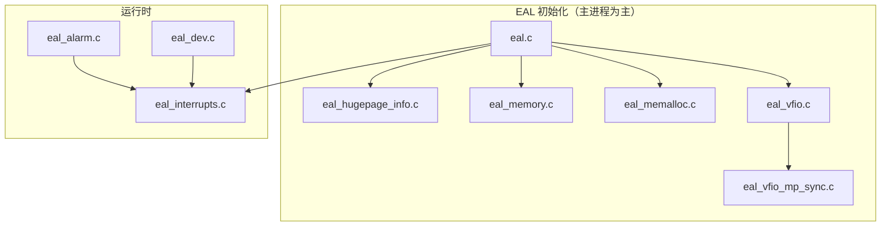

# DPDK `lib/eal/linux` 目录代码说明

本文档基于仓库内 `spdk/dpdk/lib/eal/linux` 源码与 `meson.build` 归纳，描述 **Linux 环境下 EAL（Environment Abstraction Layer）** 各编译单元职责及相互关系，便于结合 SPDK 学习 DPDK 底层。

---

## 1. 目录定位

`lib/eal/linux` 是 DPDK **EAL 的 Linux 实现**：封装进程/线程、巨页内存、中断、定时器、VFIO/IOMMU、设备热插拔等与 OS 强相关的逻辑。通用 API 声明在 `lib/eal/include` 等公共头文件中，本目录提供 **Linux 专用实现**。

---

## 2. 设计原理

本节说明 **为何** 将 EAL 拆成当前形态，以及各子系统在架构上要解决什么问题（与具体函数名无关，侧重设计动机）。

### 2.1 分层：可移植 API 与 OS 实现分离

DPDK 上层（轮询驱动、内存池、PCI 总线等）只依赖 **`rte_eal`、`rte_memory`、`rte_vfio`** 等稳定接口。与内核交互的细节（sysfs、`/dev/vfio`、`epoll`、`hugetlbfs`）全部收敛在 **`lib/eal/<os>`** 中。这样可以在 **FreeBSD** 等环境换一套实现，而不改业务代码。本目录即 **Linux 侧唯一真相源**：所有“怎么 open、怎么 ioctl、怎么 mmap”的决策都在这里或由其调用的公共辅助模块完成。

### 2.2 主从多进程：共享元数据 + 受限重复初始化

DPDK 支持 **Primary / Secondary** 多进程共用同一块大页内存与同一批设备视图。设计要点是：

- **主进程**负责：探测巨页、建立 **`rte_mem_config`**、映射 VFIO/IOMMU、向内核登记 DMA 可访问区间等“全局一次”的操作。
- **从进程**通过 **共享内存 + 文件锁** 读到同一份 memseg 布局；对 VFIO 则往往 **不能** 完全重复一遍 container 初始化，因此用 **`rte_mp` 通道**把已打开的 **container/group fd** 或关键信息从主进程交给从进程（见 `eal_vfio_mp_sync.c`）。

该模型的目标是：**数据面内存与设备 IOVA 空间一致**，同时避免多进程各自 `VFIO_SET_IOMMU` 导致冲突。

### 2.3 巨页内存：降低 TLB 压力并服务 DMA

标准 4KiB 页在 GB 级缓冲区上会带来 **TLB miss** 与页表遍历开销；用户态高性能路径希望 **大页 + 可控布局**。EAL 通过 **hugetlbfs / memfd / MAP_HUGETLB** 等机制预留内存，并把 **虚拟连续、物理尽量连续** 的段登记到全局 **`rte_memseg`**，供 `rte_malloc`、驱动 DMA 描述符_ring 使用。

**IOVA 模式**（物理地址 / VA / 混合）与 **IOMMU** 联动：设备看到的 DMA 地址必须与 VFIO/IOMMU 映射一致，因此 `eal_memory` 里会有 **基址、掩码、与 VFIO 映射回调** 等逻辑，而不是简单 `malloc`。

### 2.4 中断与 Alarm：独立线程 + epoll，避免阻塞数据核

传统阻塞式 `read()` 中断会占用业务线程时间。EAL 将 **UIO/VFIO/eventfd/timerfd** 统一放入 **专用中断线程**，用 **`epoll`** 等待就绪，再调用驱动注册的回调。这样 **worker lcore 可保持轮询**，中断只作为“事件通知”路径。

`eal_alarm` 基于 **`timerfd`** 再挂到同一套 **`rte_intr`** 上，复用 **“fd → 回调”** 模型，避免为定时器单独再搞一条阻塞路径。

### 2.5 VFIO：对齐内核安全模型（Container / Group / Device）

Linux 把 **IOMMU group** 作为最小隔离单元，**VFIO container** 绑定 **IOMMU 上下文** 与 **DMA 映射表**。EAL 的实现顺序体现内核约束：

1. 打开 **`/dev/vfio/vfio`** 得到 container；
2. 打开 **`/dev/vfio/<N>`** 得到 group fd，**`VFIO_GROUP_SET_CONTAINER`** 把 group 挂到 container；
3. 选择 **`VFIO_SET_IOMMU`** 类型并 **注册进程内可 DMA 内存**（与巨页分配联动）；
4. **`VFIO_GROUP_GET_DEVICE_FD`** 得到 device fd，再交给 PCI 子系统映射 BAR。

这样 **用户态 DMA** 只能打到已登记物理页，满足虚拟化与安全场景；**no-IOMMU** 模式则是开发/无 IOMMU 硬件下的折中，通过 sysfs 开关识别（`eal_vfio.c` 中的探测逻辑）。

### 2.6 设备热插拔：内核事件 + 用户态协同释放

**Netlink uevent** 让 EAL 感知设备增减；**VFIO REQ** 等机制要求用户态在设备移除前 **unmap、关 fd**。因此有 **`eal_dev`** 与总线 **`hot_unplug_handler`**、**SIGBUS**（映射失效）配合：**先停数据路径，再释资源**，避免崩溃。这是“高性能直通”在 **动态拓扑** 下的必要代价。

### 2.7 小结：设计目标对照

| 目标 | 实现手段（概念） |
|------|------------------|
| 跨 OS 可移植 | 公共头文件 API + `linux/` 专用实现 |
| 多进程共享内存与 IOVA | `rte_mem_config`、MP 同步、VFIO fd 传递 |
| 高性能内存 | 巨页、memseg、与 IOMMU DMA 映射一致 |
| 数据核不被中断阻塞 | 中断线程 + epoll + 统一 `rte_intr` |
| 安全 DMA / 虚拟化 | VFIO container、group、IOMMU 类型选择 |
| 安全热插拔 | uevent、REQ notifier、SIGBUS、总线回调 |

---

## 3. 构建配置（`meson.build`）

参与编译的源文件如下（依赖 `kvargs`、`telemetry`；若启用 libnuma 则定义 `RTE_EAL_NUMA_AWARE_HUGEPAGES`；ASan 构建可能链接 `librt`）：

| 源文件 | 说明 |
|--------|------|
| `eal.c` | EAL 主入口、运行时目录、多进程共享配置、初始化大流程 |
| `eal_alarm.c` | 基于 `timerfd` 的 alarm 与中断子系统集成 |
| `eal_cpuflags.c` | 通过 `getauxval` / `/proc/self/auxv` 读取 CPU 特性 |
| `eal_dev.c` | Netlink uevent、设备热插拔监控、SIGBUS 与 VFIO req 等 |
| `eal_hugepage_info.c` | 从 sysfs 采集巨页信息（`/sys/kernel/mm/hugepages` 等） |
| `eal_interrupts.c` | epoll 中断线程、UIO/VFIO/定时器 fd 统一回调 |
| `eal_lcore.c` | CPU 探测、NUMA socket、core id（读 `/sys/devices/system/cpu`） |
| `eal_memalloc.c` | 巨页分配/释放、memfd、段 fd 管理、内存热插拔与 MP 同步 |
| `eal_memory.c` | 巨页映射、IOVA/VA、`rte_mem_virt2phy`、DMA 掩码等与内存布局 |
| `eal_thread.c` | `gettid`、`pthread_setname_np` 等线程辅助 |
| `eal_timer.c` | 时间源（含可选 HPET `/dev/hpet` mmap） |
| `eal_vfio.c` | VFIO container/group/device、IOMMU 类型、DMA 映射、API 封装 |
| `eal_vfio_mp_sync.c` | 多进程下 VFIO fd 通过 `rte_mp` 从主进程传递 |

头文件子目录 `include/`：`rte_os.h`（队列宏、`cpu_set_t` 封装）、`rte_os_shim.h` 等。

---

## 4. 按模块简述

### 4.1 `eal.c` — EAL 核心

- 运行时目录清理、文件锁、`mem_cfg_fd` 等对 **`struct rte_mem_config`** 的多进程同步。
- 与 **IOMMU groups**（`/sys/kernel/iommu_groups`）等系统信息交互（宏 `KERNEL_IOMMU_GROUPS_PATH`）。
- 调用各子模块完成 **`rte_eal_init` 相关路径**（具体函数名随版本在 `eal_private.h` / `eal.c` 内部分段实现）。
- 包含对 **`rte_vfio`** 相关头文件的引用，与 VFIO 初始化链路衔接。

### 4.2 `eal_memory.c` — 巨页与全局内存布局

- 文档注释说明：在 **hugetlbfs** 上建文件、`mmap`、整理物理连续/虚拟连续等（DPDK 经典巨页模型）。
- `eal_get_baseaddr()`：用户态映射起始 VA 策略（与 IOVA 模式、DMA 地址宽度相关）。
- `rte_mem_virt2phy`：通过 `/proc/self/pagemap` 等解析物理地址（受内核配置影响）。
- 与 **内部 malloc 堆**、`rte_memseg` 列表协同，体量较大（约两千行级），是 **性能路径的基础**。

### 4.3 `eal_memalloc.c` — 分配器与 fd 生命周期

- **单文件段** vs **每页一文件** 两种模式；维护 `fd_list`、与 **内存热插拔** 及 **多进程 local_memsegs** 同步。
- 使用 **`memfd`**、`fallocate` / `ftruncate`、**`MAP_HUGETLB` 相关标志**（随内核能力变化）。
- 与 `eal_memory.c` 分工：`eal_memalloc` 偏 **分配/回收与 fd**，`eal_memory` 偏 **映射策略与全局 VA/IOVA**。

### 4.4 `eal_hugepage_info.c` — 启动前巨页探测

- 读取 `/sys/kernel/mm/hugepages/hugepages-*` 下 **free/resv/overcommit/surplus** 等。
- 按 NUMA 节点遍历 `/sys/devices/system/node` 获取 **每节点巨页** 信息。
- 使用 **共享内存文件**（`open` + `ftruncate` + `mmap(MAP_SHARED)`）持久化 hugepage 映射元数据，供主/子进程协调。

### 4.5 `eal_interrupts.c` — 统一中断服务

- 独立 **中断线程** + **`epoll`**，管理 **pipe、eventfd、VFIO、UIO、timerfd** 等事件源。
- 维护 `rte_intr_source` 链表与用户回调；VFIO 侧涉及 **`vfio_irq_set`** 等缓冲区长度宏（与 `uapi/linux/vfio.h` 对应）。
- 为 **网卡/设备驱动** 提供可注册的异步中断路径。

### 4.6 `eal_alarm.c` — 定时回调

- 基于 **`timerfd`**（`CLOCK_MONOTONIC[_RAW]`）与 **`rte_intr`** 集成，实现 `rte_eal_alarm_*` 语义。
- 链表管理 alarm、与中断线程协同执行回调。

### 4.7 `eal_timer.c` — 时间基准

- 默认时间源与 **`eal_timer_source`**（如 HPET）相关。
- 若编译 **`RTE_LIBEAL_USE_HPET`**：打开 **`/dev/hpet`**，`mmap` **HPET MMIO 寄存器**，用于高精度计时（x86 常见）。

### 4.8 `eal_lcore.c` — 逻辑核与拓扑

- `eal_cpu_detected`：检查 `/sys/devices/system/cpu/cpu%u/topology/core_id` 是否存在。
- `eal_cpu_socket_id`：在 `/sys/devices/system/node/node*/cpu*` 中查找 lcore 所属 NUMA。
- `eal_cpu_core_id`：读取 sysfs 中的 **physical core id**。

### 4.9 `eal_thread.c` — 线程接口

- `rte_sys_gettid`：`syscall(SYS_gettid)`。
- `rte_thread_set_name`：在支持的 glibc 上调用 **`pthread_setname_np`**。

### 4.10 `eal_cpuflags.c` — CPU 特性

- 优先 **`getauxval`**；不可用时回退读 **`/proc/self/auxv`**，解析 **ELF auxv** 以支持 `rte_cpu_getauxval` / `rte_cpu_strcmp_auxval`。

### 4.11 `eal_dev.c` — 设备与热插拔

- **Netlink** 监听内核 uevent，识别 **PCI / UIO / VFIO** 子系统事件。
- **SIGBUS**：设备映射失效时与 **`rte_bus_sigbus_handler`** 协作。
- 与 **VFIO REQ notifier**、总线 **hot_unplug_handler** 共同完成安全卸载路径。

### 4.12 `eal_vfio.c` — VFIO 与 IOMMU

- **`open("/dev/vfio/vfio")`**：`vfio_open_container_fd` → container fd，`VFIO_GET_API_VERSION`、`VFIO_CHECK_EXTENSION`。
- **`open("/dev/vfio/<group>` 或 `noiommu-<group>`)**：`vfio_open_group_fd`。
- **`ioctl(VFIO_GROUP_SET_CONTAINER)`**、选择 **IOMMU 类型**、**DMA 映射**（大页注册、内存事件回调等）。
- **`rte_vfio_setup_device`**：`VFIO_GROUP_GET_DEVICE_FD`、`VFIO_DEVICE_GET_INFO`，供 PCI 总线 `pci_vfio.c` 映射 BAR。
- **`rte_vfio_noiommu_is_enabled`**：读 **`/sys/module/vfio/parameters/enable_unsafe_noiommu_mode`**。

内部类型与 MP 请求码见 **`eal_vfio.h`**（`vfio_iommu_type`、`SOCKET_REQ_*` 等）。

### 4.13 `eal_vfio_mp_sync.c` — VFIO 多进程同步

- 主进程注册 **`EAL_VFIO_MP`** action：响应子进程的 **container fd**、**group fd**、**IOMMU type** 查询。
- 子进程通过 **`rte_mp_request_sync`** 获取 fd，避免重复打开或状态不一致。

---

## 5. 模块依赖关系（概念）

- **内存**：`eal_hugepage_info` → `eal_memory` / `eal_memalloc` 配合完成保留与映射。
- **VFIO**：`eal_vfio` 建立 container/IOMMU；**PCI** 驱动在 `drivers/bus/pci/linux/pci_vfio.c` 使用 `rte_vfio_setup_device` 得到的 device fd。
- **中断**：设备与 alarm 依赖 **`eal_interrupts`** 的 epoll 线程。

---

## 6. 阅读建议

| 目标 | 建议文件 |
|------|----------|
| 整体启动与多进程 | `eal.c`、`eal_memcfg` / `eal_private`（公共私有头） |
| 巨页与 DMA | `eal_memory.c`、`eal_memalloc.c`、`eal_hugepage_info.c` |
| VFIO 全流程 | `eal_vfio.c`、`eal_vfio.h`、`eal_vfio_mp_sync.c`，并对照 `drivers/bus/pci/linux/pci_vfio.c` |
| 中断与定时 | `eal_interrupts.c`、`eal_alarm.c`、`eal_timer.c` |
| 热插拔 | `eal_dev.c` |

---

## 7. 文档信息

- **路径**：`spdk/dpdk/lib/eal/linux/`
- **生成日期**：2026-03-20
- **说明**：行数与符号名以当前仓库快照为准；升级 SPDK/DPDK 版本时请对照官方 **Programmer’s Guide / EAL** 与对应版本源码。
